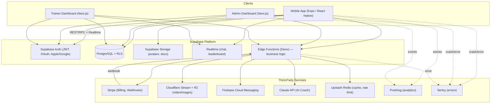

# 2. Technical Roadmap

## 2.1 Guiding Principles

1. **Managed over self-hosted** wherever it doesn't sacrifice control we actually need — a 2-3 person founding engineering team should not be running Kubernetes on day one.
2. **One backend, many clients** — mobile app and web dashboards talk to the same Supabase project + Edge Functions, never to each other directly.
3. **Type safety end-to-end** — TypeScript everywhere, database types generated from the schema, shared Zod validation between client and server.
4. **Boring technology for the core, interesting technology only where it's the product** — Postgres/Auth/Stripe are boring on purpose; the AI Coach and 9-Round timer/animation experience are where we spend novelty budget.

## 2.2 Full Stack

| Layer | Choice | Why |
|---|---|---|
| **Mobile app** | React Native + Expo (EAS Build/Submit/Update) + TypeScript | Single codebase for iOS/Android, OTA JS updates without app-store review for non-native changes, huge ecosystem, Expo Router for file-based navigation, and it's what was specified. |
| **Mobile styling** | NativeWind (Tailwind for RN) + custom design tokens | Enforces the black/white/gold system consistently, fast to theme, works with the same mental model as the web (Tailwind). |
| **Mobile animation** | React Native Reanimated + Moti, Lottie for one-off brand animations | Needed for Apple-quality motion (timer transitions, glassmorphism blur, progress rings) at 60fps on the UI thread. |
| **Mobile state** | Zustand (client/UI state) + TanStack Query (server state/caching) | Avoids Redux boilerplate; TanStack Query gives us caching, retries, and offline-friendly refetch for free, which matters for a fitness app used mid-workout with flaky gym wifi. |
| **Admin + Trainer web** | Next.js 14+ (App Router, TypeScript, Server Components) | Server-rendered dashboards, great data-table/report ergonomics, deploys natively to Vercel, one framework for both portals (role-gated routes) to keep a 2-person team from maintaining two web apps. |
| **Web UI kit** | Tailwind CSS + shadcn/ui (Radix primitives) | Accessible components out of the box, fully ownable code (not a black-box component library), matches the mobile design tokens via a shared `packages/ui` token file. |
| **Backend platform** | Supabase (PostgreSQL, Auth, Storage, Realtime, Edge Functions) | Postgres is the right database for relational fitness/business data (users, subscriptions, programs); Supabase gives us Auth, RLS-secured REST/GraphQL, realtime (chat, leaderboard), and file storage without standing up separate services — critical for shipping fast as a small team, while still being "real" Postgres we can scale/tune later. |
| **Business logic / custom endpoints** | Supabase Edge Functions (Deno + TypeScript) | For anything that isn't a straight CRUD/RLS operation: Stripe webhooks, AI calls, notification fan-out, QR check-in validation, report generation. Deployed independently of the mobile/web release cycle. |
| **Auth** | Supabase Auth — Email/password, Google OAuth, Apple Sign-In | Apple Sign-In is an App Store requirement once any third-party login exists; Supabase Auth issues JWTs consumed directly by Postgres RLS, so "who is allowed to see this row" is enforced at the database, not re-implemented per endpoint. |
| **Payments** | Stripe (Billing, Checkout, Customer Portal, Webhooks) | Industry standard for subscriptions, handles proration/dunning/tax (Stripe Tax) for us, and has first-class mobile SDKs. Apple/Google IAP handled per store policy — see [Security Plan](07-security-plan.md) and [Deployment Plan](08-deployment-plan.md). |
| **Video hosting & delivery** | Cloudflare Stream (encoding + adaptive HLS + thumbnails) backed by Cloudflare R2 (raw asset storage) | Exercise/program video is the heaviest bandwidth cost at scale. Stream gives adaptive bitrate and signed playback URLs without us building a transcoding pipeline; R2 has zero egress fees, which matters once thousands of users are streaming exercise demos daily. |
| **Images / progress photos** | Cloudflare R2 + Cloudflare Images (resizing/variants) | Same egress-cost rationale; private buckets with signed URLs for progress photos (sensitive user content). |
| **Push notifications** | Firebase Cloud Messaging via `expo-notifications` | Cross-platform push without maintaining separate APNs/FCM plumbing; Expo's notification service sits on top of FCM/APNs. |
| **AI Coach** | Claude API (Anthropic) via Edge Functions | Used for: adaptive workout generation, nutrition suggestions, progress analysis, motivational messages, chat coach. Model tiering: a fast/cheap model for short motivational messages and simple Q&A, a stronger model for structured plan generation and progress analysis (see [API Architecture §5.6](05-api-architecture.md#56-ai-endpoints)). |
| **Realtime** | Supabase Realtime (Postgres logical replication) | Powers chat-with-coach, live leaderboard updates, and admin notification badges without a separate WebSocket service. |
| **Background jobs / queue** | Supabase Queues (pgmq) + `pg_cron`, escalating to Upstash QStash if needed | AI generation, notification fan-out, and report generation are async by nature; a Postgres-native queue avoids introducing a separate broker (e.g. SQS/RabbitMQ) before it's justified by load. |
| **Caching / rate limiting** | Upstash Redis (serverless, pay-per-request) | Leaderboard read caching, AI-endpoint rate limiting, idempotency keys for payment webhooks — serverless Redis avoids paying for an always-on instance pre-scale. |
| **Analytics (product)** | PostHog (cloud, EU or US hosting per data-residency needs) | Funnels, retention cohorts, feature flags, and session replay in one tool; feature flags double as our rollout mechanism for risky features. |
| **Error monitoring** | Sentry (mobile + web + edge functions) | One pane of glass across React Native, Next.js, and Deno edge functions. |
| **Transactional email** | Resend (or Postmark) | Auth emails, receipts, trainer/admin notifications; Resend integrates cleanly with React Email templates for a consistent branded look. |
| **Monorepo tooling** | Turborepo + pnpm workspaces | Shared types/UI/config across mobile, web, and edge functions with fast, cached builds; the natural choice given three TypeScript "apps" sharing one domain model. |
| **CI/CD** | GitHub Actions (lint/test/typecheck/build) + EAS Build/Submit (mobile) + Vercel (web) + Supabase CLI (db/functions) | Each deployable target has a dedicated, independent pipeline so a mobile release never blocks a dashboard hotfix or vice versa. |

## 2.3 High-Level System Diagram

## 2.4 Key Data Flows

**AI Coach chat message**
`Mobile App → Edge Function (validate + rate-limit via Upstash) → Claude API → persist message in Postgres → Realtime pushes response to client`

**Video upload (trainer/admin uploads exercise demo)**
`Admin/Trainer Web → Edge Function issues Cloudflare Stream direct-upload URL → browser uploads directly to Cloudflare → Cloudflare webhook confirms encoding done → Edge Function updates `exercises.video_status` in Postgres`

**Subscription checkout (web / Stripe Checkout)**
`Mobile/Web → Edge Function creates Stripe Checkout Session → user pays on Stripe-hosted page → Stripe webhook → Edge Function verifies signature → updates `subscriptions` table → push notification confirms`

**QR Check-in**
`Gym displays QR (venue_id + rotating token) → Mobile App scans → Edge Function validates token + records `qr_checkins` → triggers habit/streak update`

## 2.5 Why Not X? (Decisions Explicitly Rejected)

| Alternative considered | Rejected because |
|---|---|
| Custom Node/Express + self-managed Postgres (RDS) | More infra to operate for zero functional benefit at this stage; Supabase gives us the same Postgres plus Auth/Storage/Realtime/RLS for less operational overhead. We are not locked in — it's Postgres, so a future migration off Supabase is a connection-string change plus re-implementing Auth/Storage, not a data migration. |
| Firebase Firestore as primary DB | Fitness/subscription/coaching data is deeply relational (users↔programs↔workouts↔logs↔subscriptions); a document database fights this model. Firebase is used narrowly, for what it's best at: push notifications. |
| Flutter for mobile | Team's stated TypeScript/React direction (matches the Next.js dashboards); React Native lets code (types, validation schemas, some business logic) be shared with the web packages via the monorepo. |
| GraphQL gateway (custom) | Supabase already exposes an auto-generated PostgREST + optional GraphQL layer; adding a hand-rolled GraphQL gateway is unjustified complexity pre-scale. Edge Functions cover the cases that need custom logic. |
| Self-hosted video (S3 + own transcoding) | Video transcoding pipelines are a full engineering project on their own; Cloudflare Stream is purpose-built for exactly this and cheaper at our expected scale than building it. |

Next: [Folder Structure →](03-folder-structure.md)
