# 4. Database Schema

> **Updated for the 6-role model, bilingual content, and AI-readiness tables** (see [Roles & Permissions](12-roles-and-permissions.md), [Internationalization](11-internationalization.md), and [DDD Architecture §13.4](13-ddd-architecture.md)). The exact, currently-implemented Phase 1 schema — matching the real SQL in `supabase/migrations/` — is [`docs/phase-1/02-database-schema.md`](phase-1/02-database-schema.md); this document remains the whole-product (all-phase) reference.

PostgreSQL via Supabase. `auth.users` (managed by Supabase Auth) is extended with a `public.profiles` table rather than modified directly. Every table has Row Level Security (RLS) enabled; policies are summarized per table and detailed in [Security Plan §7.2](07-security-plan.md#72-row-level-security-strategy).

Conventions: `id uuid default gen_random_uuid()` primary keys, `created_at` / `updated_at timestamptz` on every table, soft-delete via `deleted_at timestamptz null` on user-facing content tables.

## 4.1 Entity-Relationship Overview

```mermaid
erDiagram
    PROFILES ||--o{ STAFF_CLIENT_ASSIGNMENTS : "is client of"
    PROFILES ||--o| STAFF_PROFILES : "is staff (1:1, trainer/nutritionist/reception)"
    STAFF_PROFILES ||--o{ STAFF_CLIENT_ASSIGNMENTS : manages
    PROFILES ||--o{ SUBSCRIPTIONS : has
    SUBSCRIPTION_PLANS ||--o{ SUBSCRIPTIONS : defines
    PROFILES ||--o{ PAYMENTS : makes
    PROFILES ||--o{ USER_PROGRAMS : enrolled_in
    PROGRAMS ||--o{ USER_PROGRAMS : assigned_as
    PROGRAMS ||--o{ PROGRAM_WEEKS : contains
    PROGRAM_WEEKS ||--o{ WORKOUTS : contains
    WORKOUTS ||--o{ WORKOUT_EXERCISES : contains
    EXERCISES ||--o{ WORKOUT_EXERCISES : referenced_by
    EXERCISE_CATEGORIES ||--o{ EXERCISES : categorizes
    PROFILES ||--o{ WORKOUT_LOGS : logs
    WORKOUTS ||--o{ WORKOUT_LOGS : logged_as
    WORKOUT_LOGS ||--o{ EXERCISE_SET_LOGS : contains
    PROFILES ||--o{ NUTRITION_PLANS : assigned
    NUTRITION_PLANS ||--o{ MEALS : contains
    MEALS ||--o{ MEAL_FOOD_ITEMS : contains
    FOOD_ITEMS ||--o{ MEAL_FOOD_ITEMS : referenced_by
    PROFILES ||--o{ HABITS : defines
    HABITS ||--o{ HABIT_LOGS : logs
    PROFILES ||--o{ WATER_LOGS : logs
    PROFILES ||--o{ WEIGHT_LOGS : logs
    PROFILES ||--o{ BODY_COMPOSITION_LOGS : logs
    PROFILES ||--o{ PROGRESS_PHOTOS : uploads
    PROFILES ||--o{ USER_ACHIEVEMENTS : earns
    ACHIEVEMENTS ||--o{ USER_ACHIEVEMENTS : defines
    CHALLENGES ||--o{ CHALLENGE_PARTICIPANTS : has
    PROFILES ||--o{ CHALLENGE_PARTICIPANTS : joins
    PROFILES ||--o{ CHAT_MESSAGES : sends
    CHAT_CONVERSATIONS ||--o{ CHAT_MESSAGES : contains
    PROFILES ||--o{ AI_COACH_MESSAGES : sends
    PROFILES ||--o{ NOTIFICATIONS : receives
    PROFILES ||--o{ PUSH_TOKENS : registers
    PROFILES ||--o{ REFERRALS : refers
    VENUES ||--o{ QR_CHECKINS : hosts
    PROFILES ||--o{ QR_CHECKINS : checks_in
    PROFILES ||--o{ COMMUNITY_POSTS : authors
    COMMUNITY_POSTS ||--o{ COMMUNITY_COMMENTS : has
    COMMUNITY_POSTS ||--o{ COMMUNITY_LIKES : has
    PROFILES ||--o{ SUPPORT_TICKETS : opens
    SUPPORT_TICKETS ||--o{ SUPPORT_TICKET_MESSAGES : contains
    COUPONS ||--o{ COUPON_REDEMPTIONS : redeemed_as
    PROFILES ||--o{ DOMAIN_EVENTS : "acted on"
    PROFILES ||--o{ AI_INSIGHTS : "receives"
```

## 4.2 Tables by Domain

### Identity & Roles

**`profiles`** (extends `auth.users`, 1:1 via `id`)
| Column | Type | Notes |
|---|---|---|
| id | uuid PK, FK → auth.users.id | |
| full_name | text | |
| avatar_url | text | Supabase Storage path |
| role | enum: `client`, `trainer`, `nutritionist`, `reception`, `admin`, `super_admin` | Drives RLS and app routing — see [Roles & Permissions](12-roles-and-permissions.md) |
| preferred_locale | enum: `en`, `ar` | Drives RTL/LTR + notification language — see [Internationalization](11-internationalization.md) |
| gender | enum: `female`, `male`, `unspecified` nullable | Collected on the Body Metrics onboarding screen |
| date_of_birth | date nullable | Collected as "age" in the UI, converted to an approximate date of birth — see `packages/identity/domain/body-metrics.ts` |
| height_cm | numeric(5,1) nullable | Collected on the Body Metrics onboarding screen |
| weight_kg | numeric(5,2) nullable | Denormalized "current weight"; full history lives in `weight_logs` once the tracking context ships |
| goal | enum: `weight_loss`, `muscle_gain`, `general_fitness`, `athletic_performance` | Drives onboarding recommendations — matches the Fitness Goal Selection screen exactly |
| experience_level | enum: `beginner`, `intermediate`, `advanced` | |
| onboarding_completed_at | timestamptz nullable | |
| referral_code | text unique | auto-generated |
| referred_by | uuid nullable, FK → profiles.id | |

**`staff_profiles`** (1:1 extension of `profiles` where `role` is `trainer`/`nutritionist`/`reception` — one shared table for all three staff types instead of three parallel ones; see [Roles & Permissions §12.2](12-roles-and-permissions.md#122-why-one-shared-staff-model-instead-of-three-parallel-ones))
| Column | Type | Notes |
|---|---|---|
| profile_id | uuid PK, FK → profiles.id | |
| role | enum: `trainer`, `nutritionist`, `reception` | |
| bio | text | |
| specialties | text[] | e.g. `{boxing, weight_loss, football}` |
| certifications | jsonb | list of {name, issuer, verified} |
| years_experience | int | |
| is_approved | boolean default false | Admin/super_admin must approve before staff is client-facing |
| rating_avg | numeric(3,2) | Denormalized, recalculated on new reviews (future) |

**`staff_client_assignments`**
| Column | Type | Notes |
|---|---|---|
| id | uuid PK | |
| staff_id | uuid, FK → staff_profiles.profile_id | |
| client_id | uuid, FK → profiles.id | |
| context | enum: `training`, `nutrition` | Which coaching relationship this governs |
| status | enum: `active`, `paused`, `ended` | |
| assigned_at | timestamptz | |

Unique constraint on `(staff_id, client_id, context)` where `status = 'active'`.

### Billing

**`subscription_plans`** — admin-managed catalog (Free/Plus/Elite × monthly/annual)
| Column | Type | Notes |
|---|---|---|
| id | uuid PK | |
| name | text | |
| tier | enum: `free`, `plus`, `elite` | |
| billing_interval | enum: `monthly`, `annual` | |
| price_cents | int | |
| stripe_price_id | text | |
| features | jsonb | feature-flag map used by entitlement checks |
| is_active | boolean | |

**`subscriptions`**
| Column | Type | Notes |
|---|---|---|
| id | uuid PK | |
| profile_id | uuid, FK → profiles.id | |
| plan_id | uuid, FK → subscription_plans.id | |
| stripe_subscription_id | text unique | |
| stripe_customer_id | text | |
| status | enum: `trialing`, `active`, `past_due`, `canceled`, `incomplete` | Mirrors Stripe status |
| current_period_end | timestamptz | |
| cancel_at_period_end | boolean | |

**`payments`**
| Column | Type | Notes |
|---|---|---|
| id | uuid PK | |
| profile_id | uuid, FK → profiles.id | |
| subscription_id | uuid nullable, FK → subscriptions.id | |
| stripe_payment_intent_id | text unique | |
| amount_cents | int | |
| currency | text | |
| status | enum: `succeeded`, `failed`, `refunded` | |

**`coupons`** / **`coupon_redemptions`**
| coupons | code text unique, discount_type enum(`percent`,`fixed`), amount, max_redemptions, expires_at, is_active |
| coupon_redemptions | coupon_id, profile_id, redeemed_at, unique(coupon_id, profile_id) |

### Training Content

Every `name`/`description` column below is a `translated_text` domain (`jsonb` shaped `{"en": "...", "ar": "..."}`, English required) rather than a plain `text` column — see [Internationalization §11.3](11-internationalization.md#113-translatable-content-database-strategy).

**`exercise_categories`** — id, name (translated_text), slug, icon
**`exercises`** — the exercise library
| Column | Type | Notes |
|---|---|---|
| id | uuid PK | |
| category_id | uuid, FK | |
| name | translated_text | |
| description | translated_text nullable | |
| equipment | text[] | e.g. `{bodyweight}`, `{dumbbell, bench}` — powers "home workout" filtering |
| muscle_groups | text[] | |
| difficulty | enum: `beginner`,`intermediate`,`advanced` | |
| video_id | text nullable | Cloudflare Stream video UID |
| thumbnail_url | text | |
| created_by | uuid, FK → profiles.id | trainer/admin who added it |

**`programs`** — a full training program (e.g. "6-Week Fat Burn," "Football Conditioning")
| id, name (translated_text), description (translated_text), cover_image_url, goal (matches profiles.goal enum), duration_weeks, difficulty, is_template (boolean — reusable vs trainer-custom), created_by, is_published |

**`program_weeks`** — id, program_id, week_number
**`workouts`** — id, program_week_id nullable (null = standalone/library workout), name (translated_text), description (translated_text), format (enum: `9_round`, `circuit`, `strength`, `hiit`, `steady_state`), estimated_duration_minutes, order_index
**`workout_exercises`** — id, workout_id, exercise_id, order_index, rounds, work_seconds, rest_seconds, sets, reps, target_weight, notes

**`user_programs`** — a program assigned to / chosen by a user
| id, profile_id, program_id, assigned_by (trainer/admin id, nullable if self-selected), started_at, status (`active`,`completed`,`abandoned`), current_week |

### Logging & Tracking

**`workout_logs`** — id, profile_id, workout_id, started_at, completed_at, duration_seconds, calories_estimate, notes
**`exercise_set_logs`** — id, workout_log_id, workout_exercise_id, set_number, reps_completed, weight_used, round_number nullable (for 9-Round format), rpe nullable

**`habits`** — id, profile_id, name, target_frequency (enum: `daily`,`weekly`), icon, is_active
**`habit_logs`** — id, habit_id, logged_date date, completed boolean — unique(habit_id, logged_date)
**`water_logs`** — id, profile_id, logged_at, amount_ml
**`weight_logs`** — id, profile_id, logged_at, weight_kg
**`body_composition_logs`** — id, profile_id, logged_at, body_fat_percent, muscle_mass_kg, source (enum: `manual`,`inbody_scan`), inbody_raw jsonb nullable (full InBody scan payload)
**`progress_photos`** — id, profile_id, taken_at, photo_url (private Storage/R2 path), angle (enum: `front`,`side`,`back`)

### Nutrition

**`nutrition_plans`** — id, profile_id, assigned_by nullable, name (plain text — personally authored, not library content), daily_calorie_target, macro_protein_g, macro_carbs_g, macro_fat_g, start_date, end_date. Owned by nutritionists, not trainers — see [Roles & Permissions](12-roles-and-permissions.md).
**`meals`** — id, nutrition_plan_id, name (`breakfast`,`lunch`,`dinner`,`snack`), order_index
**`food_items`** — id, name (translated_text — shared library content), calories_per_100g, protein_per_100g, carbs_per_100g, fat_per_100g, is_verified (nutritionist/admin-curated vs user-added)
**`meal_food_items`** — id, meal_id, food_item_id, quantity_grams

### Gamification & Community

**`achievements`** — id, name, description, icon, criteria jsonb (e.g. `{type: "streak", value: 30}`)
**`badges`** — id, name, icon, tier (`bronze`,`silver`,`gold`)
**`user_achievements`** — id, profile_id, achievement_id, earned_at
**`challenges`** — id, name, description, type (`most_workouts`,`streak`,`total_minutes`), start_date, end_date, is_public
**`challenge_participants`** — id, challenge_id, profile_id, score (denormalized, updated via trigger/job), rank
**`community_posts`** — id, profile_id, content, media_urls text[], created_at, deleted_at
**`community_comments`** — id, post_id, profile_id, content
**`community_likes`** — id, post_id, profile_id — unique(post_id, profile_id)

A materialized view `leaderboard_weekly` aggregates `workout_logs` + `challenge_participants` for fast leaderboard reads (see [Scalability Plan §10.3](10-scalability-plan.md#103-read-heavy-endpoints)).

### Communication

**`chat_conversations`** — id, trainer_id, client_id, last_message_at (denormalized for sorting)
**`chat_messages`** — id, conversation_id, sender_id, content, attachment_url nullable, read_at nullable
**`ai_coach_conversations`** — id, profile_id, started_at
**`ai_coach_messages`** — id, conversation_id, role (`user`,`assistant`), content, metadata jsonb (tokens, model used)
**`notifications`** — id, profile_id, type, title, body, data jsonb, read_at nullable
**`push_tokens`** — id, profile_id, expo_push_token, device_type, is_active

### Operations

**`venues`** — id, name, address, qr_secret (rotating token seed) — partner gyms for check-in
**`qr_checkins`** — id, profile_id, venue_id, checked_in_at
**`support_tickets`** — id, profile_id, subject, status (`open`,`pending`,`resolved`,`closed`), priority, assigned_admin_id
**`support_ticket_messages`** — id, ticket_id, sender_id, content, is_internal_note boolean
**`admin_audit_log`** — id, admin_id, action, target_table, target_id, before jsonb, after jsonb, created_at
**`referrals`** — id, referrer_id, referred_id, status (`pending`,`rewarded`), reward_applied_at

## 4.3 Row Level Security Strategy (summary)

| Table group | Client | Trainer | Nutritionist | Reception | Admin / Super Admin |
|---|---|---|---|---|---|
| `profiles` (own row) | SELECT/UPDATE own | SELECT own + assigned clients | SELECT own + assigned clients | SELECT (narrow, via `reception_member_lookup`) | ALL |
| `workout_logs`, `habit_logs`, `weight_logs`, etc. | SELECT/INSERT/UPDATE own only | SELECT for assigned clients only | SELECT for assigned clients only (weight/body-comp only) | none | ALL |
| `programs`, `exercises` (content) | SELECT published only | SELECT all + INSERT/UPDATE own-created | SELECT all | none | ALL |
| `nutrition_plans`, `meals`, `food_items` | SELECT own | none | SELECT all + INSERT/UPDATE own-created | none | ALL |
| `chat_messages` | SELECT/INSERT where profile is a participant | same | same | none | ALL (support access) |
| `subscriptions`, `payments` | SELECT own (read-only; writes only via Edge Function w/ service role) | none | none | SELECT active subscriptions only (check-in) | ALL; refunds gated to super_admin at the application layer |
| `admin_audit_log` | none | none | none | none | SELECT/INSERT |
| `domain_events`, `ai_insights` | SELECT own (`ai_insights` only) | none | none | none | SELECT (`domain_events`); ALL (`ai_insights`) |

Every policy check in every migration routes through the `is_admin()` / `is_super_admin()` / `is_staff(roles)` SQL helper functions (`supabase/migrations/20260801000001_extensions_and_enums.sql`) rather than inlining `auth.jwt() ->> 'role'` comparisons — see [Roles & Permissions §12.3](12-roles-and-permissions.md#123-admin-vs-super-admin--the-actual-distinction) for why admin and super_admin need to be distinguishable at all. Full policy definitions live as SQL in `supabase/migrations/`, one policy per operation per table (never a blanket `USING (true)`), detailed further in [Security Plan §7.2](07-security-plan.md#72-row-level-security-strategy).

## 4.7 AI-Readiness Tables

Two tables exist specifically so **every** feature can plug into AI without a bespoke integration, per the requirement that every feature support future AI (see [DDD Architecture §13.4–13.5](13-ddd-architecture.md#134-cross-context-communication-domain-events-not-direct-calls)):

- **`domain_events`** — an append-only log of "what happened" (`workout.completed`, `subscription.status_changed`, …), written via the `emit_domain_event()` helper function from triggers on the tables that matter. This is the one stream any future AI feature (progress analysis, adaptive plans) reads from, instead of each feature building its own bespoke event pipeline.
- **`ai_insights`** — a polymorphic table (`entity_type`, `entity_id`, `insight_type`, `content`, `model`) any context can attach AI-generated content to (a motivation message, a plan-adjustment suggestion) without a dedicated table per AI feature.

Both are implemented now, in Phase 1, even though the `ai` bounded context's actual use cases (Phase 3) don't exist yet — the infrastructure is cheap to build early and expensive to retrofit once every other table already has activity that should have been logged from day one.

## 4.4 Indexing Notes

- Every FK column gets a btree index (Supabase does not auto-index FKs).
- `workout_logs(profile_id, started_at desc)`, `habit_logs(habit_id, logged_date)`, `weight_logs(profile_id, logged_at desc)` — composite indexes for the "history over time" query pattern used on every tracking chart.
- `exercises` gets a `pg_trgm` GIN index on `name` for fuzzy search.
- `chat_messages(conversation_id, created_at)` for pagination.
- Partitioning strategy for high-volume log tables at scale is covered in [Scalability Plan §10.2](10-scalability-plan.md#102-database-scaling).

Next: [API Architecture →](05-api-architecture.md)
