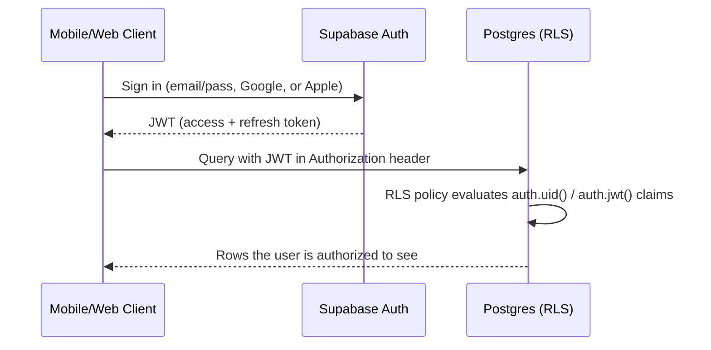

# 5. API Architecture

> **Package names updated**: `packages/api-client` and `packages/schemas` (referenced below) were superseded by the per-bounded-context `application`/`infrastructure` layers described in [`docs/13-ddd-architecture.md`](13-ddd-architecture.md) — e.g. what this document calls "the typed api-client" is now each context's composition-root factory (`createIdentityModule`, etc.). The principles and endpoint catalog below are otherwise unchanged.

## 5.1 Principles

9th Round does **not** hand-roll a REST layer for CRUD, and the backend is built **API-first**: every capability — mobile screens, the admin/trainer web portals, and any future integration — is a consumer of the same two surfaces below, never a special direct-database path unique to one client. This is what makes "future web and mobile apps use the same backend" (requirement 3) true by construction rather than by convention.

1. **Supabase auto-generated PostgREST API** — used directly by clients (via each bounded context's `infrastructure/` repository — see [`docs/13-ddd-architecture.md §13.2`](13-ddd-architecture.md#132-the-layering-inside-every-bounded-context-package)) for straightforward, RLS-protected reads/writes: fetching programs, logging a workout set, listing habits, etc. This is ~70% of app traffic and needs zero hand-written endpoint code — RLS *is* the authorization layer.
2. **Supabase Edge Functions and Postgres RPC functions** — used for anything that is (a) business logic beyond a row insert, (b) talks to a third party (Stripe, Claude, FCM, Cloudflare), (c) needs the service-role key, or (d) needs column-level (not just row-level) access restriction — e.g. `reception_member_lookup()`, a `SECURITY DEFINER` SQL function callable via PostgREST RPC exactly like any other endpoint (see [Roles & Permissions §12.5](12-roles-and-permissions.md#125-receptions-narrow-surface-by-design)). These are the "real" API endpoints and are cataloged below.

All Edge Functions: TypeScript (Deno), validate input with shared Zod schemas (living in each bounded context's `application/` layer post-restructure), return a consistent envelope, and are independently deployable/versionable from the app releases.

## 5.2 Auth Flow



- Access tokens are short-lived (1 hour default); TanStack Query + Supabase client handle silent refresh.
- `role` (`client`/`trainer`/`admin`) is stored in `profiles.role` and mirrored into a custom JWT claim via a Supabase Auth Hook so RLS policies and Edge Functions can check it without an extra DB round-trip.
- Apple Sign-In and Google OAuth are configured as Supabase Auth third-party providers — no custom OAuth handling in app code.

## 5.3 Response Envelope

```ts
// success
{ "data": { ... }, "error": null }
// failure
{ "data": null, "error": { "code": "PLAN_NOT_FOUND", "message": "..." } }
```

Error codes are stable, machine-readable strings (not just HTTP status codes) so client error handling doesn't parse messages.

## 5.4 Edge Function Catalog

| Endpoint | Method | Auth | Purpose |
|---|---|---|---|
| `/functions/v1/create-checkout-session` | POST | client | Creates a Stripe Checkout Session for a plan; returns URL/client secret |
| `/functions/v1/stripe-webhook` | POST | Stripe signature | Handles `checkout.session.completed`, `invoice.payment_failed`, `customer.subscription.updated/deleted` → syncs `subscriptions`/`payments` |
| `/functions/v1/create-billing-portal-session` | POST | client | Stripe Customer Portal link for self-serve plan management |
| `/functions/v1/ai-workout-generator` | POST | client (Plus/Elite) | Generates a personalized program using profile + goal + equipment via Claude |
| `/functions/v1/ai-nutrition-suggestion` | POST | client (Plus/Elite) | Suggests meals/macros based on goal, weight logs, dietary prefs |
| `/functions/v1/ai-progress-analysis` | POST | client (Plus/Elite) | Analyzes weight/body-fat/workout-log trends, returns insight text + flags for trainer follow-up |
| `/functions/v1/ai-motivation-message` | POST | client | Short motivational push copy, triggered by scheduler (missed workout, streak milestone) |
| `/functions/v1/ai-chat-coach` | POST | client (Plus/Elite) | Conversational endpoint; streams response, persists to `ai_coach_messages` |
| `/functions/v1/qr-checkin` | POST | client | Validates rotating venue token, writes `qr_checkins`, updates streak/habit |
| `/functions/v1/referral-apply` | POST | client | Validates referral code at signup, credits both parties per referral program rules |
| `/functions/v1/video-upload-url` | POST | trainer/admin | Requests a Cloudflare Stream direct-creator-upload URL |
| `/functions/v1/cloudflare-stream-webhook` | POST | Cloudflare signature | Marks `exercises.video_status = 'ready'` once encoding completes |
| `/functions/v1/notifications-send` | POST | internal (service role, called by triggers/cron) | Fan-out push notification to FCM via `push_tokens` |
| `/functions/v1/reports-generate` | POST | admin | Generates revenue/engagement CSV/PDF report for a date range |
| `/functions/v1/admin-approve-trainer` | POST | admin | Sets `trainer_profiles.is_approved = true`, notifies trainer |

## 5.5 Request/Response Examples

**Create Checkout Session**
```http
POST /functions/v1/create-checkout-session
Authorization: Bearer <jwt>
Content-Type: application/json

{ "planId": "uuid-of-plus-monthly" }
```
```json
{
  "data": { "checkoutUrl": "https://checkout.stripe.com/c/pay/..." },
  "error": null
}
```

**AI Workout Generator**
```http
POST /functions/v1/ai-workout-generator
Authorization: Bearer <jwt>

{
  "goal": "fat_burning",
  "experienceLevel": "beginner",
  "availableEquipment": ["bodyweight", "dumbbell"],
  "daysPerWeek": 4,
  "durationWeeks": 6
}
```
```json
{
  "data": {
    "program": {
      "name": "6-Week Fat Burn — Bodyweight & Dumbbell",
      "weeks": [ { "weekNumber": 1, "workouts": [ /* ... */ ] } ]
    }
  },
  "error": null
}
```
Internally: builds a structured prompt from the profile + a curated subset of the `exercises` table (never lets the model invent exercises outside the library, to guarantee every returned exercise has a real video/demo), calls Claude with a strict JSON output schema, validates the response against the `packages/schemas` workout schema before persisting — if validation fails, retries once, then falls back to a curated template program.

**QR Check-in**
```http
POST /functions/v1/qr-checkin
Authorization: Bearer <jwt>

{ "venueId": "uuid", "token": "rotating-token-from-qr" }
```
```json
{ "data": { "checkedInAt": "2026-07-28T10:00:00Z", "streakDays": 12 }, "error": null }
```

## 5.6 AI Endpoints — Model Tiering

| Endpoint | Model class | Rationale |
|---|---|---|
| `ai-motivation-message` | Fast/small model | High volume (per-user, scheduled), low complexity, latency-sensitive |
| `ai-chat-coach` | Mid-tier, conversational | Needs good instruction-following and tone, but runs interactively so cost/latency both matter |
| `ai-workout-generator`, `ai-nutrition-suggestion`, `ai-progress-analysis` | Strongest available model | Structured, multi-constraint reasoning (safety limits, progressive overload, injury flags) where quality matters more than latency; run async with a loading state, not real-time |

All AI endpoints enforce: per-user rate limits (Upstash), content safety instructions (no medical diagnosis, defer to a physician for injury/pain reports), and full audit logging of prompts/responses for quality review and dispute resolution.

## 5.7 Versioning & Change Management

- Edge Functions are versioned by folder path (`/functions/v1/...`); breaking changes ship as `v2` folders rather than mutating `v1` behavior, so old mobile app versions in the wild keep working during the store-review lag.
- Supabase-generated types (`packages/types/supabase.ts`) are regenerated and committed on every migration, so a breaking DB change fails the client's typecheck at build time, not at runtime.

## 5.8 Rate Limiting & Idempotency

- All Edge Functions check a per-user token bucket in Upstash Redis; AI endpoints have tighter limits than CRUD-adjacent ones.
- Stripe webhook handler is idempotent on `stripe_event_id` (stored, checked before processing) since Stripe can redeliver events.
- Client-initiated mutations that must not double-fire (checkout session creation, referral application) accept an optional client-generated `Idempotency-Key` header.

Next: [UI Flow & Wireframes →](06-ui-flow-and-wireframes.md)
