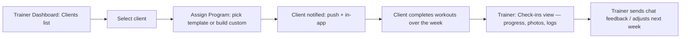
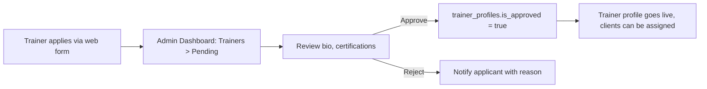

# 6. UI Flow & Wireframes

A visual low-fidelity wireframe board (mobile screens + admin/trainer dashboard layout, rendered in the actual black/white/gold design language) was shared as an interactive artifact alongside this document. This file is the durable, versioned reference: design tokens, user journeys, and per-screen structure.

## 6.1 Design System Tokens

| Token | Value | Usage |
|---|---|---|
| `color.background` | `#0B0B0C` (near-black) | Primary app background |
| `color.surface` | `#161616` | Cards, sheets |
| `color.surface-glass` | `rgba(255,255,255,0.06)` + backdrop-blur(20px) | Glassmorphism panels (stat cards, timer overlay) |
| `color.foreground` | `#FFFFFF` | Primary text |
| `color.muted` | `#9A9A9A` | Secondary text |
| `color.gold` | `#C9A227` | Primary accent — CTAs, progress rings, active states, badges |
| `color.gold-gradient` | `linear-gradient(135deg, #C9A227, #F4D976)` | Premium accents (subscription upsells, achievements) |
| `radius.card` | 20px | |
| `radius.pill` | 999px | Buttons, tags |
| `type.display` | SF Pro Display / Inter, 32–40px, semibold | Screen headers |
| `type.body` | SF Pro Text / Inter, 15–17px | |
| `motion.standard` | 250ms, ease-out | Screen transitions |
| `motion.timer` | spring (damping 18) | 9-Round timer state changes |

Design principle: **black is the canvas, white is the content, gold is earned** — gold appears on progress, achievements, and premium/CTA moments, not decoratively everywhere, to keep the "luxury minimal" feel rather than looking gaudy.

## 6.2 Key User Journeys

### Onboarding → First Workout

```mermaid
flowchart LR
    A[Splash] --> B[Sign up: Email/Google/Apple]
    B --> C[Goal selection]
    C --> D[Experience level]
    D --> E[Equipment / home vs gym]
    E --> F[Body metrics: weight, height, optional body-fat]
    F --> G[Plan recommendation: Free vs Plus vs Elite]
    G -->|Free| H[Home Dashboard]
    G -->|Plus/Elite| I[Stripe Checkout]
    I --> H
    H --> J[Suggested first program]
    J --> K[Workout Player / 9-Round Timer]
```

### Workout Session (9-Round Timer)

```mermaid
flowchart LR
    A[Program → Workout detail] --> B[Start Workout]
    B --> C[Exercise demo video + rounds/rest config]
    C --> D[9-Round Timer running: work interval]
    D --> E[Rest interval]
    E -->|rounds remaining| D
    E -->|final round done| F[Log sets/reps/weight/RPE]
    F --> G[Workout summary: duration, calories, streak]
    G --> H[Achievement unlock? optional]
    H --> I[Back to Home]
```

### Trainer Assigns Program → Client Completes → Trainer Reviews

### Admin Approves a New Trainer

## 6.3 Mobile App — Screen Inventory

| Screen | Purpose | Key components |
|---|---|---|
| Onboarding (5 steps) | Goal/experience/equipment/metrics capture | Progress dots, single-choice cards, gold CTA |
| Home / Dashboard | Daily snapshot | Today's workout card, habit ring, water tracker chip, streak badge |
| Train Tab | Browse programs & exercise library | Filter chips (goal, equipment, difficulty), program cards with cover art |
| Workout Player | Execute a workout | Large round-count ring (gold on black), work/rest color state, video loop of current exercise, big pause/skip controls |
| Nutrition Tab | View plan, log meals | Macro rings (protein/carbs/fat), meal cards, quick-add food search |
| Progress Tab | Track body metrics | Line charts (weight, body-fat), photo comparison slider (before/after), InBody scan entry |
| Habits | Daily checklist | Checkbox list, streak flame icon |
| Challenges / Leaderboard | Competitive engagement | Ranked list, avatar + score, current-user row pinned/highlighted |
| Community Feed | Social proof, engagement | Post cards, like/comment, glass-blur bottom composer |
| Chat with Coach | Trainer messaging | Standard chat UI, read receipts, attachment for progress photos |
| AI Coach | Conversational assistant | Chat UI with distinct gold-accent bubble for AI, quick-prompt chips ("adjust my plan," "I'm sore today") |
| Profile / Settings | Account, subscription, notifications | Plan badge, manage subscription (opens Stripe portal), notification toggles |
| QR Check-in | Scan at partner gym | Camera viewfinder overlay, success animation |

## 6.4 Admin Dashboard — Screen Inventory

| Screen | Purpose |
|---|---|
| Overview | Revenue this month, active subscribers, churn, DAU — chart-forward |
| Users | Searchable table, filters by plan/status, drill into profile |
| Trainers | Pending approvals queue, active trainer list, performance snapshot |
| Programs & Exercise Library | CRUD for programs/workouts/exercises, video upload flow |
| Nutrition | Manage food database, plan templates |
| Subscriptions & Coupons | Plan catalog editor, coupon creation, subscription lookup |
| Revenue Dashboard | MRR trend, plan mix, failed-payment recovery queue |
| Support Tickets | Queue with priority/status, ticket detail with internal notes |
| Reports | Generate/download CSV/PDF exports |
| Notifications | Compose/send broadcast push notifications, view delivery stats |

## 6.5 Trainer Dashboard — Screen Inventory

| Screen | Purpose |
|---|---|
| My Clients | List of assigned clients with last-active + adherence indicator |
| Client Detail | Full history: logs, body metrics, photos, program progress |
| Programs | Create/edit programs, assign to one or many clients |
| Exercise Library | Upload/manage exercises (subset of admin's, scoped to own uploads) |
| Check-ins | Weekly check-in review queue with quick-feedback templates |
| Messages | Chat threads with clients |
| Schedule | Calendar view of assigned workouts across clients |

## 6.6 Wireframe Reference

Because static wireframe images can't be embedded directly in this repo in a maintainable way, the actual low-fidelity visual mockups (Home, Workout Player/Timer, Progress, Admin Overview, Trainer Client Detail) were generated as an interactive HTML board using these exact tokens, so stakeholders can review layout and hierarchy before any component code is written. Regenerate/update that board whenever a screen's structure changes here.

Next: [Security Plan →](07-security-plan.md)
