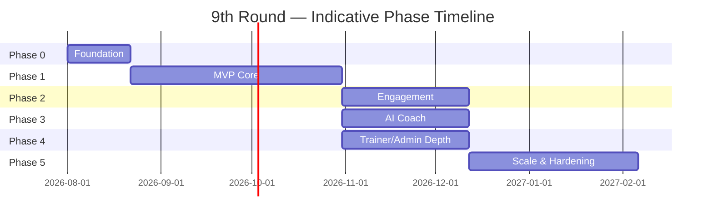

# 9. Development Phases

Estimates assume a small founding team (roughly 2–4 engineers + 1 designer, founder as product owner); adjust proportionally with team size. Each phase ends with an explicit exit criteria checklist — the next phase does not start until the current one is met, matching the "never rush" principle for this project.

## Phase 0 — Foundation (2–3 weeks)

**Goal:** Nothing user-facing yet; make every later phase fast and safe.

- Monorepo scaffolding (Turborepo, pnpm, shared configs) per [Folder Structure](03-folder-structure.md)
- Supabase projects created (dev/staging/prod), initial schema migrated per [Database Schema](04-database-schema.md)
- Design tokens + shared `packages/ui` primitives implemented for both NativeWind and web
- Auth wired end-to-end (email + Google + Apple) with role-based JWT claim
- CI pipeline (`ci.yml`) green on an empty-but-structured repo
- Sentry + PostHog wired into all three apps (mobile, web, edge functions)

**Exit criteria:** a developer can sign up, log in, and see an empty role-appropriate home screen on mobile and web, with CI passing and error/analytics events visibly flowing.

## Phase 1 — MVP: Core Training & Tracking (6–10 weeks)

**Goal:** A user can complete a real workout and track real progress, and pay for it.

- Profile & onboarding flow
- Exercise library + program/workout data model populated with an initial content set
- Workout player with 9-Round Timer + Rest Timer
- Workout logging (sets/reps/weight)
- Habit tracker, water tracker, weight tracker, body-fat/InBody entry, progress photos
- Nutrition plans (view + log meals)
- Subscription plans + Stripe Checkout + webhook sync (web first; mobile IAP compliance work included here, see [Deployment Plan §8.3](08-deployment-plan.md#mobile-store-billing-compliance))
- Push notifications (workout reminders, streak nudges)
- Minimal admin screens needed to operate: create programs/exercises/videos, view users, view subscriptions

**Exit criteria:** a paying user can complete the full loop — sign up → get a program → work out with the timer → log progress → see it reflected in Progress tab — without any manual database intervention.

## Phase 2 — Engagement Layer (4–6 weeks)

**Goal:** Give users reasons to come back daily and interact with each other.

- Achievements & badges (streak-based, milestone-based)
- Challenges + leaderboard (materialized view per [Database Schema §4.2](04-database-schema.md))
- Community feed (posts, comments, likes)
- Chat with Coach (requires trainer accounts to exist — coordinate with Phase 4 trainer onboarding)
- Workout calendar & statistics views
- Referral program
- QR check-in (requires at least one partner venue configured)

**Exit criteria:** engagement KPIs (D7 retention, workouts/week/user) are instrumented in PostHog and being actively tracked against a baseline from Phase 1.

## Phase 3 — AI Coach (4–6 weeks)

**Goal:** The AI differentiator, built on real usage data from Phases 1–2 so it has something real to reason about.

- `ai-workout-generator`, `ai-nutrition-suggestion`, `ai-progress-analysis`, `ai-motivation-message`, `ai-chat-coach` Edge Functions (per [API Architecture §5.4](05-api-architecture.md))
- Model tiering + rate limiting + prompt/response audit logging
- Adaptive plan adjustments (AI proposes changes; for Elite-tier clients, changes route through the assigned trainer for approval rather than auto-applying — keeps the "real trainer + AI" positioning honest)

**Exit criteria:** AI Coach is opt-in tested with a small user cohort, cost-per-user is measured and within the plan's unit economics, and output quality is reviewed against the safety guidelines in [Security Plan/API Architecture].

## Phase 4 — Trainer & Admin Depth (4–6 weeks, can overlap Phase 2/3)

**Goal:** Trainers and internal ops can run the business without engineering intervention.

- Full Trainer Dashboard: client assignment, program building, check-in review, scheduling
- Full Admin Dashboard: revenue dashboard, coupons, support tickets, reports, notification broadcast
- Trainer application/approval workflow
- Admin audit log surfaced in UI

**Exit criteria:** the founder/ops team can onboard a new trainer, assign clients, issue a coupon, and resolve a support ticket entirely through the dashboards — zero direct database access needed for day-to-day operation.

## Phase 5 — Scale & Hardening (ongoing, starts before Phase 4 finishes)

**Goal:** Ready for 100,000+ users, not just correct at hundreds.

- Load testing against the [Scalability Plan](10-scalability-plan.md) targets
- Database index/partition review under real query patterns
- Video CDN cache-hit-rate tuning
- Third-party penetration test (per [Security Plan §7.9](07-security-plan.md#79-pre-launch-security-checklist))
- Internationalization pass if expanding beyond the initial launch market
- Cost review and AI model-tier tuning based on real usage data

**Exit criteria:** synthetic load test sustains target concurrent users at acceptable p95 latency; security review findings resolved; on-call/incident-response runbook exists.

## Summary Timeline

Note: Phases 2, 3, and 4 can run partially in parallel across a small team once Phase 1's data model and auth are stable — they touch mostly disjoint parts of the schema and codebase, per the vertical-slice folder structure.

Next: [Scalability Plan →](10-scalability-plan.md)
