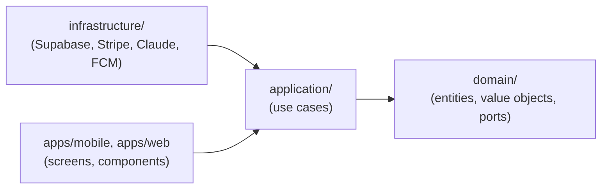

# 13. Clean Architecture & Domain-Driven Design

This supersedes the "vertical-slice feature folder" framing in [`docs/03-folder-structure.md`](03-folder-structure.md) §3.2 — that document is retained for the historical product-architecture record, but the actual package layout follows the model below, and is what's implemented in the repository today.

## 13.1 Bounded Contexts

The domain is split into contexts with their own ubiquitous language, each a package under `packages/`:

| Context | Package | Owns |
|---|---|---|
| **Identity & Access** | `packages/identity` | Profile, StaffProfile, Role, onboarding, role assignment — *implemented* |
| **Training** | `packages/training` | Program, Workout, Exercise, WorkoutLog, the 9-Round timer model |
| **Nutrition** | `packages/nutrition` | NutritionPlan, Meal, FoodItem |
| **Tracking** | `packages/tracking` | Habit, WeightLog, BodyCompositionLog, ProgressPhoto, streaks |
| **Billing** | `packages/billing` | Subscription, Payment, Coupon, entitlement rules |
| **Notifications** | `packages/notifications` | Notification, PushToken, locale-aware templates |
| **AI** | `packages/ai` | AIInsight, the ChatCompletionPort every other context's AI extension point ultimately resolves to |

Cross-cutting concerns that are **not** bounded contexts (no business rules, no aggregates) live in their own shared packages instead: `packages/shared-kernel` (Result type, DomainEvent base, value objects), `packages/i18n` (translation resources), `packages/ui` (design system), `packages/database-types` (generated Supabase types), `packages/supabase-client` (typed client factory), `packages/config` (tooling).

## 13.2 The Layering Inside Every Bounded-Context Package

```
packages/<context>/
├── domain/            entities, value objects, domain events, repository PORTS (interfaces)
├── application/        use cases — orchestrate domain/ through ports, never import infrastructure
├── infrastructure/       Supabase repositories + external adapters — implements domain/'s ports
└── index.ts             public API: the composition root + the types apps are allowed to import
```

**The dependency rule** (Clean Architecture's actual point): dependencies only point inward.



- `domain/` imports nothing but `packages/shared-kernel`. No Supabase, no React, no HTTP.
- `application/` imports `domain/` and calls its repository **ports** — never a concrete Supabase client.
- `infrastructure/` is the only layer allowed to import `packages/database-types` and `packages/supabase-client`, and is where the ports get real implementations.
- Apps depend only on a context's `index.ts` export — a composition-root factory (e.g. `createIdentityModule(client)`) that wires the real infrastructure to the use cases. A screen never imports `packages/identity/infrastructure/*` directly.

This is fully built out — not just documented — for the **Identity** context: see `packages/identity/domain/{profile,role,profile-repository}.ts`, `packages/identity/application/{complete-onboarding,assign-staff-role}.ts`, `packages/identity/infrastructure/{supabase-profile-repository,profile-mapper}.ts`, tested with 14 passing unit tests using an in-memory fake repository (`packages/identity/application/test-helpers.ts`) — the use cases are tested with **zero database**, which is the entire payoff of the port/adapter split. Every other context's package currently holds this same skeleton with a `README.md` describing its planned entities/use cases/ports (see [`docs/phase-1/01-folder-structure.md`](phase-1/01-folder-structure.md)), implemented in the order set by [`docs/09-development-phases.md`](09-development-phases.md).

## 13.3 Why Package-Per-Context Instead of Layer-Per-Package

An earlier draft of this architecture used one package per *layer* (`packages/domain`, `packages/api-client`) containing all features together. That was replaced because it doesn't hold up against two of the new requirements:

- **"Every module should be independently scalable"** — a package-per-context boundary means `packages/notifications`, for instance, has everything it needs (its own domain, application, infrastructure) to be lifted into its own deployable worker/service later without touching any other context's code. A layer-per-package split couples every feature's domain logic into one artifact, which is the opposite of independent scalability.
- **DDD's bounded-context principle** — "Training" and "Nutrition" genuinely have different ubiquitous languages (a "plan" means a training program in one, a diet in the other); folding them into one shared `packages/domain` blurs exactly the boundary DDD exists to make explicit.

## 13.4 Cross-Context Communication: Domain Events, Not Direct Calls

A context never imports another context's `application/` or `domain/` directly (e.g. `training` does not import `notifications` to "send a push when a workout completes"). Instead, aggregates raise **domain events** (`packages/shared-kernel/src/domain-event.ts`), persisted to the `domain_events` table (`supabase/migrations/20260801000001_extensions_and_enums.sql`) by infrastructure. `workout_logs` already demonstrates the pattern end to end: `trg_workout_logs_emit_event()` fires `workout.completed` into `domain_events` the moment a workout is marked complete (`supabase/migrations/20260801000005_tracking_and_logs.sql`).

This is also the mechanism behind requirement 4 — **every feature supports future AI integration** — without bespoke per-feature integration work: `domain_events` is one consistent stream of "what happened" across every context; the `ai` package's future use cases (`AnalyzeProgress`, `GenerateMotivationMessage`) read from it and from `packages/ai/domain`'s `AIInsight` aggregate, writing results back to the `ai_insights` table, which any context's presentation layer can query for "does this entity have an AI insight attached" without that context needing to know anything about how the insight was produced.

## 13.5 AI as a First-Class Extension Point, Not a Bolt-On

Every bounded context that plausibly benefits from AI declares its own **port** for it in `domain/` (e.g. `training`'s planned `AIWorkoutRecommendationPort`, `nutrition`'s `AINutritionSuggestionPort`) — an interface the context's own use cases depend on, exactly like a repository port. The `ai` package provides the one concrete adapter (`ChatCompletionPort`, Claude-backed) that gets wired to each context's port at the composition root. A context's application logic is written and tested against the *port*, so:

- Training/Nutrition/Tracking use cases are fully testable today with a fake AI adapter, before any real AI integration exists.
- Swapping or upgrading the underlying model is a change in exactly one place (`packages/ai/infrastructure`), never a change to `training`, `nutrition`, or `tracking`'s own code.

## 13.6 Where UI Fits

`packages/ui` (design tokens + native/web primitives) and each app's `apps/*/src/components` are **presentation**, not a bounded context — modeling a design system as a DDD aggregate would be a category error (there's no business rule to protect; a `Button` has no invariant). See [`docs/phase-1/07-component-architecture.md`](phase-1/07-component-architecture.md) for how presentation composes with the application layer via the container/view split.

## 13.7 Testing Implication

Because `domain/` and `application/` never import infrastructure, every use case is unit-testable with a plain in-memory fake implementing the relevant port — no test database, no mocked HTTP client, no Supabase test project. This is demonstrated, not aspirational: `packages/identity`'s 14 tests run in under a second with zero I/O. This is the concrete reason Clean Architecture was worth adopting for a team this size, not architecture for its own sake.

Next: [Deployment Plan (app store prep) →](08-deployment-plan.md)
