# 3. ER Diagram (Phase 1)

Scoped to exactly the tables created in `supabase/migrations/`. The full, all-phase diagram lives in [`docs/04-database-schema.md §4.1`](../04-database-schema.md#41-entity-relationship-overview).

```mermaid
erDiagram
    PROFILES ||--o| TRAINER_PROFILES : "is trainer (1:1, optional)"
    PROFILES ||--o{ TRAINER_CLIENTS : "is client of"
    TRAINER_PROFILES ||--o{ TRAINER_CLIENTS : manages

    SUBSCRIPTION_PLANS ||--o{ SUBSCRIPTIONS : defines
    PROFILES ||--o{ SUBSCRIPTIONS : has
    PROFILES ||--o{ PAYMENTS : makes
    SUBSCRIPTIONS ||--o{ PAYMENTS : "billed as"
    COUPONS ||--o{ COUPON_REDEMPTIONS : "redeemed as"
    PROFILES ||--o{ COUPON_REDEMPTIONS : redeems

    EXERCISE_CATEGORIES ||--o{ EXERCISES : categorizes
    PROFILES ||--o{ EXERCISES : "created by (trainer/admin)"
    PROGRAMS ||--o{ PROGRAM_WEEKS : contains
    PROGRAM_WEEKS ||--o{ WORKOUTS : contains
    WORKOUTS ||--o{ WORKOUT_EXERCISES : contains
    EXERCISES ||--o{ WORKOUT_EXERCISES : "referenced by"
    PROFILES ||--o{ USER_PROGRAMS : "enrolled in"
    PROGRAMS ||--o{ USER_PROGRAMS : "assigned as"

    PROFILES ||--o{ WORKOUT_LOGS : logs
    WORKOUTS ||--o{ WORKOUT_LOGS : "logged as"
    WORKOUT_LOGS ||--o{ EXERCISE_SET_LOGS : contains
    WORKOUT_EXERCISES ||--o{ EXERCISE_SET_LOGS : "referenced by"

    PROFILES ||--o{ HABITS : defines
    HABITS ||--o{ HABIT_LOGS : logs
    PROFILES ||--o{ WATER_LOGS : logs
    PROFILES ||--o{ WEIGHT_LOGS : logs
    PROFILES ||--o{ BODY_COMPOSITION_LOGS : logs
    PROFILES ||--o{ PROGRESS_PHOTOS : uploads

    PROFILES ||--o{ NUTRITION_PLANS : assigned
    NUTRITION_PLANS ||--o{ MEALS : contains
    MEALS ||--o{ MEAL_FOOD_ITEMS : contains
    FOOD_ITEMS ||--o{ MEAL_FOOD_ITEMS : "referenced by"

    PROFILES ||--o{ PUSH_TOKENS : registers
    PROFILES ||--o{ NOTIFICATIONS : receives
    PROFILES ||--o{ ADMIN_AUDIT_LOG : "acts as admin"
```

## Reading Notes

- `PROFILES` is the hub of the whole schema — it 1:1-extends `auth.users` (not shown; managed by Supabase Auth) and every other table hangs off either `profile_id` or a chain that terminates in one.
- `TRAINER_PROFILES` is an *optional* 1:1 extension of `PROFILES` (only exists where `role = 'trainer'`), not a separate identity — a trainer is a profile with an extra row, not a different kind of user, which is why `trainer_clients` references `trainer_profiles.profile_id` directly rather than a separate trainer ID space.
- `WORKOUTS.program_week_id` is nullable — a workout can exist as a standalone library item (`program_week_id is null`) or as part of a program's week structure, which is how the exercise/workout library and program-authoring share one table instead of two parallel ones.
- `SUBSCRIPTIONS`/`PAYMENTS` have no incoming edges from anything client-writable — they are populated exclusively by the `stripe-webhook` Edge Function, which is why they're drawn as leaf-ish nodes fed only by `PROFILES` and `SUBSCRIPTION_PLANS`.

Next: [API Documentation →](04-api-documentation.md)
