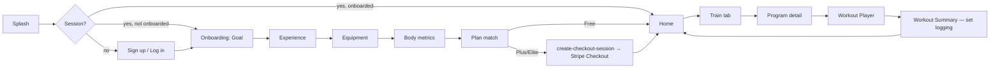
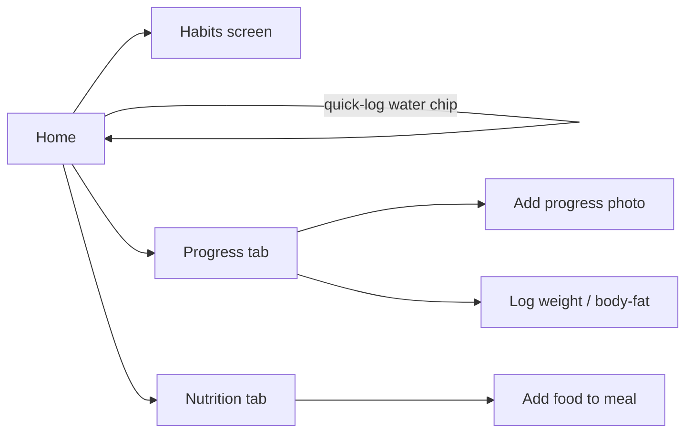
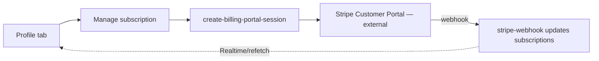
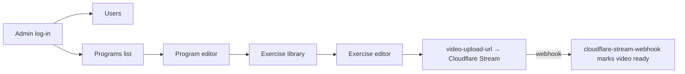

# 6. Navigation Flow (Phase 1)

## 6.1 Mobile — Expo Router Tree

File-based routing; groups in parentheses don't appear in the URL/segment. Matches the screen list in [05-screen-list.md](05-screen-list.md).

```
app/
├── index.tsx                       # splash — redirects based on session + onboarding_completed_at
├── (auth)/
│   ├── sign-up.tsx
│   ├── log-in.tsx
│   └── onboarding/
│       ├── goal.tsx → experience.tsx → equipment.tsx → metrics.tsx → plan.tsx
├── (tabs)/                          # bottom tab bar, only reachable once authenticated + onboarded
│   ├── index.tsx                    # Home
│   ├── train.tsx                    # Program/exercise browse
│   ├── nutrition.tsx
│   ├── progress.tsx
│   └── profile.tsx
├── program/[id].tsx                 # pushed from Train tab
├── workout/[id]/
│   ├── index.tsx                    # Workout Player
│   └── summary.tsx                  # pushed on completion, not back-navigable to player
├── nutrition/add-food.tsx           # modal, pushed from Nutrition tab
├── progress/add-photo.tsx           # modal, pushed from Progress tab
├── habits/index.tsx                 # pushed from Home's habit card
└── profile/
    ├── subscription.tsx
    └── notifications.tsx
```

**Guarding rule:** a single root layout (`app/_layout.tsx`, config only at this stage) checks session + `profiles.onboarding_completed_at` and redirects: no session → `(auth)`; session but onboarding incomplete → `(auth)/onboarding/*`; both present → `(tabs)`. No screen re-implements this check individually.

## 6.2 Admin Web — Next.js App Router Tree

```
app/
├── (auth)/log-in/page.tsx
├── (admin)/
│   ├── layout.tsx                   # role guard: redirects non-admins
│   ├── users/
│   │   ├── page.tsx
│   │   └── [id]/page.tsx
│   ├── programs/
│   │   ├── page.tsx
│   │   ├── [id]/page.tsx
│   │   └── exercises/
│   │       ├── page.tsx
│   │       └── [id]/page.tsx
│   ├── nutrition/page.tsx
│   └── subscriptions/page.tsx
└── middleware.ts                    # fast-path redirect before layout even renders
```

Role protection is layered (per [`docs/05-api-architecture.md §5.2`](../05-api-architecture.md#52-auth-flow)): `middleware.ts` redirects unauthenticated/wrong-role requests before any Server Component runs, and RLS enforces the same boundary at the database in case a request ever reaches a query directly.

## 6.3 Key Journey — Onboarding → First Workout



## 6.4 Key Journey — Daily Tracking Loop



## 6.5 Key Journey — Subscription Management



## 6.6 Key Journey — Admin Operates Content (Phase 1 scope)



Next: [Component Architecture →](07-component-architecture.md)
