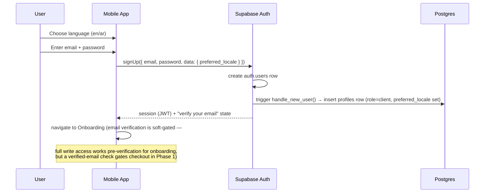
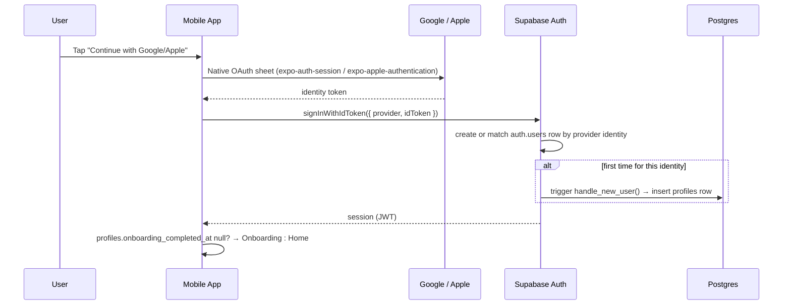

# 9. Authentication Flow (Phase 1)

Builds on [`docs/05-api-architecture.md §5.2`](../05-api-architecture.md#52-auth-flow) and [`docs/07-security-plan.md §7.1`](../07-security-plan.md#71-authentication--authorization) with the concrete Phase 1 sequences. Updated for the 6-role model ([Roles & Permissions](../12-roles-and-permissions.md)) and bilingual onboarding ([Internationalization](../11-internationalization.md)): the very first screen is now a language picker, not sign-up, since RTL must be set before anything else renders.

## 9.0 Language Selection (before sign-up)

The app's first screen lets the user choose English or Arabic. This choice is held in local UI state (not yet persisted — there's no profile to attach it to before sign-up) and passed as `preferred_locale` signup metadata the moment the user does sign up, so `handle_new_user()` (`supabase/migrations/20260801000002_profiles_and_trainers.sql`) sets the profile's locale on row creation rather than defaulting to English and requiring a second write. See [Internationalization §11.6](../11-internationalization.md#116-locale-selection--persistence).

## 9.1 Sign-Up (Email)



The `handle_new_user()` trigger (in `supabase/migrations/20260801000002_profiles_and_trainers.sql`) is what guarantees a `profiles` row always exists the instant an `auth.users` row does — no client-side "create my profile" call exists, so there's no window where a session exists but a profile lookup 404s.

## 9.2 Sign-Up / Login via Google or Apple



Apple Sign-In is mandatory on iOS the moment Google login exists (App Store Guideline 4.8) — both are configured as Supabase Auth third-party providers (`supabase/config.toml [auth.external.google]` / `[auth.external.apple]`), never hand-rolled OAuth.

## 9.3 Role Claim Propagation

`profiles.role` (`client` / `trainer` / `nutritionist` / `reception` / `admin` / `super_admin`) must be readable inside RLS policies and Edge Functions **without an extra DB round-trip per request**. Mechanism: a Supabase Auth Hook (`custom_access_token_hook`, configured at the Supabase project level, not app code) reads `profiles.role` for the authenticating user and mirrors it into a custom JWT claim on every token mint/refresh:

```json
{ "sub": "uuid", "role": "trainer", "exp": 1234567890 }
```

RLS policies read it as `(auth.jwt() ->> 'role')` (see every migration's policy definitions); Edge Functions read the same claim from the verified JWT before doing role-gated work. **A role change (e.g. admin approves a trainer) only takes effect on that user's next token refresh** — this is a known, accepted latency (max ~1 hour, the JWT expiry) rather than a bug; the alternative (checking `profiles.role` with a fresh query on every request) defeats the reason for putting it in the JWT.

## 9.4 Session Persistence

- Access token (1hr expiry) + refresh token issued at login are stored via **Expo SecureStore** (iOS Keychain / Android Keystore-backed), never `AsyncStorage`, per [`docs/07-security-plan.md §7.1`](../07-security-plan.md#71-authentication--authorization).
- `useAuthStore` (see [State Management §8.2](08-state-management.md#82-zustand-stores-needed-for-phase-1)) hydrates from SecureStore on app launch, exposing `isHydrating` so the root layout can hold the splash screen until the real session state is known — this is what prevents a flash of the login screen for an already-logged-in user.
- The Supabase JS client's built-in auto-refresh handles silent token refresh; the app never manually manages refresh timers.
- **Logout** clears SecureStore, calls `supabase.auth.signOut()`, and resets every Zustand store to its initial state (not just the auth store) — a stale `useWorkoutSessionStore` surviving a logout/login-as-different-user is the kind of bug this guards against.

## 9.5 Web (Admin) Login

Same Supabase Auth session mechanics, but:
- Session stored in an httpOnly cookie via Supabase's Next.js server-side auth helpers, not browser `localStorage`.
- `apps/web/app/(admin)/layout.tsx` and `middleware.ts` both check the `role` claim — middleware for a fast redirect before any Server Component renders, the layout as defense-in-depth in case middleware is ever bypassed or misconfigured.
- No self-serve sign-up route exists for `(admin)` — admin and trainer accounts are provisioned by an existing admin (`profiles.role` set directly, not chosen by the user at sign-up).

## 9.6 Password Reset

Standard Supabase Auth flow: `resetPasswordForEmail` → emailed link → app deep link (`9thround://reset-password?token=...`) → `updateUser({ password })`. No custom token generation/verification code — this is Supabase Auth's built-in flow end to end.

## 9.7 What Phase 1 Explicitly Does Not Build

- Two-factor authentication (planned for `trainer`/`admin` roles per [`docs/07-security-plan.md §7.1`](../07-security-plan.md#71-authentication--authorization), not a Phase 1 requirement since trainer/admin accounts are few and internally provisioned at this stage).
- Magic-link / passwordless email login (email+password and OAuth cover Phase 1 needs).

Next: [File Naming Conventions →](10-file-naming-conventions.md)
