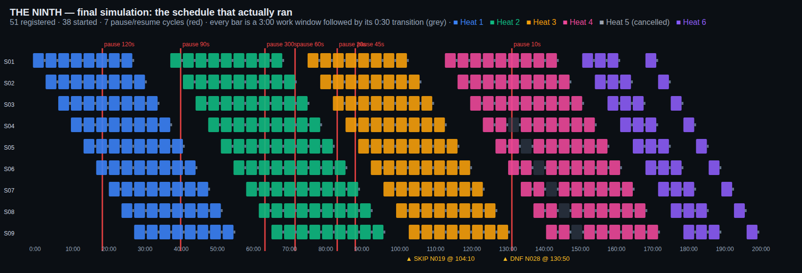
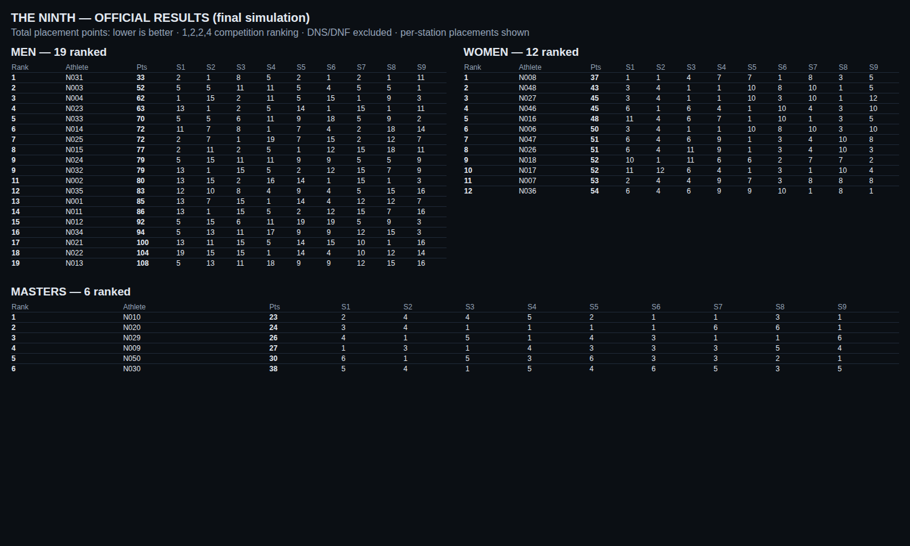

# Final end-to-end race validation — THE NINTH

Baseline: the approved checkpoint + Phases 1–10. THE NINTH stays isolated from the gym system. **No Supabase project was created, connected or configured; no credentials were requested or committed; nothing was deployed.** `apps/race` stays in the Turbo build. This phase added **no product features**; it found and fixed **one race-critical scoring bug** (§11).

## FINAL STATUS: **READY FOR PRODUCTION INFRASTRUCTURE**

The whole event — registration to official publication — ran through the real RPCs as the real roles, and an independent model (separate code, written from the rulebook, not from the SQL) agreed with the system on every window, action outcome, raw score, placement, total and rank in **all 6 consecutive final runs** (≈ 8,700 checks per run, 0 mismatches). Every exception in the brief was exercised. Concurrency storms, role matrix, audit reconstruction and append-only checks pass.

Not blockers for infrastructure, but **open before race day** (details in §13):
1. **REAL-WORLD OCR VALIDATION = PENDING.** No real rowing-monitor photos were available. Nothing was faked. A ready-to-run validator exists (§7). Until it passes on real photos, Station 09 must run with the fail-safe path in mind (a failed read → retake → Master Control manual correction, both fully audited).
2. The simulation proves the database engine, not the network, phones or Supabase itself. Run `verify/verify_deployment.sql` on the real project and repeat this simulation against it once it exists (§13).

---

## 1. How it was validated (method)

| Piece | What it is |
|---|---|
| **Independent model** `docs/race/scripts/final-model.mjs` | Generates the roster, the per-athlete per-station action plans (deliberate ties, VOIDs, NO_REPs, F-4 penalties, technique scores, Masters holds, rowing flows) and the scripted exceptions. **Re-implements** timing, scoring, OCR classification, ranking (1,2,2,4) and the rowing state machine in JS. It never reads the app's SQL. |
| **Driver** `supabase-race/tests/harness/final/{setup,run,post,audit,export}.sql` | Replays the plan against a throw-away PostgreSQL 16 with all 17 THE NINTH migrations, calling the **real RPCs as real roles** (anonymous registration, Reception, Event Manager, Master Control, 9 Judges, Station Screens) in race-time order. The race clock is moved (no real waiting); everything else is real. Invariants are checked on every 5 s tick. |
| **Comparison** | The system's state is exported as JSON and compared with the model: L1 = rules applied to the actions actually sent + official windows; L2 = replay of the exported ledger; rankings compared against both the model's raw scores and the system's raw scores. |
| **Harness** `final_validation.sh` (step 5c of `run.sh`) | Also runs the simultaneous check-in storm, START EVENT, the post-race steps, audit and append-only checks. |

The model validates *consequences*, not choices: who is skipped / withdraws is decided by the live race (the athlete in the last slot of heat 3 is skipped 50 s before their start; whoever is at Station 03 at 2:10:50 withdraws) and logged; the model then checks everything that follows.

## 2. Simulation summary

| | |
|---|---|
| Athletes registered (anonymous, public RPC) | **51** — 49 paid (rotating methods), 1 waived, **1 unpaid** (#51, refused at check-in) |
| Heats | **6**: heats 1–4 = 9 athletes each; heat 5 = 9 athletes who never arrive (MANUAL heat, **closed without start** → CANCELLED); heat 6 = 5 athletes |
| Categories | Men / Women / Masters (knee push-ups for Women and Masters and 5 Men) |
| Started the race | **38** athletes (37 FINISHED, 1 DNF); 13 MISSED_START (absent N005, heat 5, N049 too late, #51 unpaid, 1 SKIP) |
| Slots | 42: 38 STARTED, 3 EMPTY (burned), 1 SKIPPED |
| Station windows | 342 (330 LOCKED, 6 CORRECTED, 6 NOT_REACHED after the DNF) |
| Judge actions sent | **5,694**: 5,486 accepted, 206 pending Master review (156 approved / 50 rejected), 2 rejected — **408 delivered from offline queues** |
| Action types | 4,741 REP · 343 NO_REP · 439 LAP · 82 TECHNIQUE_SCORE · 29 PENALTY (F-4) · 38 VOID · 6 HOLD_START · 8 HOLD_BREAK · 8 HOLD_RESUME |
| Rowing (Station 09) steps | 138: 43 captures, 43 OCR reads (33 SUCCEEDED / 4 LOW_CONFIDENCE / 6 FAILED), 6 retakes, 30 confirmations + 5 late confirmations → Master review, refused confirmations kept in the log, 3 manual corrections + 1 after publication |
| Pause / resume cycles | **7** (10 s to 300 s; two with devices reconnecting while paused) — 645 s of paused wall time excluded from race time |
| Race length | official finish at race ms **12,120,000** (3:22:00) |
| Outcome | 3 official leaderboards: Men 19 ranked, Women 12, Masters 6 |

## 3. Timing results (all enforced by the checker, on every tick and again from the export)

Config read back from the event: **3:00 work · 0:30 transition · 3:30 start interval · 60 s countdown** — exactly.

| Invariant | Result |
|---|---|
| No early start | every slot's recorded start ≥ its planned start; planned start = heat anchor + slot × 3:30 exactly (42 slots) |
| No more than 3:00 of work, no grace | all 342 windows are exactly 180,000 ms; actions at 0.8 s before the end are accepted, at the end / 0.8 s after are not (see boundary cases, §4) |
| Every transition exactly 0:30 | lock time − window end = 30,000 ms for every reached window |
| Every start interval exactly 3:30 | consecutive slots 210,000 ms apart; heat anchors 60,000 / 2,340,000 / 4,620,000 / 6,900,000 and **heat 6 at 9,180,000 even though heat 5 was cancelled** |
| No overlap | per station, window *n+1* starts ≥ window *n* end + 0:30 (checked for every pair) |
| No slot change after binding | a per-tick check records every bound slot and fails if any ever changes |
| SKIP never moves anyone | the slot after the skipped one starts at its original time; all windows still match the arithmetic |
| Pause time excluded; pauses cannot overlap | 7 pauses at the scripted race times (±60 ms), none overlapping, none left open, `paused_total_ms` = sum of the pause wall times (±10 ms) |
| Race time authoritative after reconnect | after every blackout the screens are compared with the arithmetic: who is at each of the 9 stations, remaining time, phase |
| UI disconnection cannot change state | Master blackout, one judge offline, **all devices offline for 5 minutes (twice)** — state after reconnect equals the arithmetic; nothing was advanced, skipped or lost by a client being away |
| Event completion only after all required windows | official finish = end of the last reached window + 0:30 (never earlier, ≤ 10 s after in the run); **cancelled heat 5 did not block completion** |

Recorded start lag: when *no device at all* reads for minutes, the engine only *materialises* a start when the next reader arrives (it is a pure function of official time — by design, no ticking server). The audit records the planned time and the lag; the official time is never affected. Largest lag in the run: 130 s (inside a 5-minute total blackout); 2 starts exceeded 6 s, both inside total blackouts.

## 4. Exceptions tested

| Exception | How |
|---|---|
| Normal athletes | 37 athletes finished all 9 stations |
| **Simultaneous check-ins** | 45 sessions + 9 duplicate desk presses at the same instant → 46 active check-ins, no duplicate, no error |
| Wrong check-in + Master correction | N005 checked in by mistake, corrected to N006; original and correction both remain |
| **Late check-ins** / **late overflow** | N014 (late, during the race), N048 and N049 (after their heat's start: overflow / too late → DNS) — the engine's own rule decides each |
| DNS | absent athlete, closed heat 5, unpaid athlete |
| **DNF** | an athlete withdraws at Station 03 → stations 4–9 NOT_REACHED, ranking excludes them |
| **SKIP** | last slot of heat 3 skipped 50 s before its start → nobody else moves |
| **Emergency pause**, multiple pause/resume cycles | 7 cycles |
| **Master disconnect** | ~4 min, judges keep scoring |
| **Judge disconnect** | Station 03 judge offline ~7 min |
| **Station Screen disconnect / reconnect** | each blackout ends with every station screen compared with the arithmetic |
| **Complete client disconnect** | all devices offline 5 min (twice) + two 1-minute blackouts ending at the 3:00 boundary |
| Reconnect during **WORK**, **TRANSITION**, **PAUSE** | explicit assertions for each (race time frozen during PAUSE, every screen says so) |
| **Exactly around the 3:00 boundary** | all devices reconnect **0.8 s before** the end (queued actions accepted, athlete still ACTIVE) and **0.8 s after** (queued actions → Master review, never silently accepted) |
| **Offline judge actions** | 408 delivered from queues; the ones that lost to the lock became PENDING_MASTER_REVIEW and were approved/rejected by Master Control |
| **Offline OCR capture** | rowing judge's phone offline ~7 min |
| **OCR retake / confirmation / Master correction** | see §7 |
| **Ties / identical station scores** | deliberate equal scores at stations and equal totals; ranks 1,2,2,4 kept |
| VOID / NO_REP / F-4 penalty / technique scores | 38 VOIDs, 343 NO_REPs, 29 penalties, 82 technique scores |

## 5. Scoring verification (S01–S09)

Every raw score of all 299 scored results was recomputed by the model from the actions actually sent and compared (exact, except Masters hold ms: ±400 ms — the drift of a 160-action queue flush in the harness):

| Station | Rule checked |
|---|---|
| S01 Wall squat | Masters: hold time with break limit (the exit beyond the limit ends the hold; later RESUME ignored); others: reps |
| S02 Push-ups | knee style = floor(reps / 3), remainder ignored; NO_REP not counted; VOID removes exactly one |
| S03 Shuttle | completed 10 m laps only; F-4 can cancel only a *completed* lap |
| S04 Jab+Cross | reps, NO_REP, technique score (tie-break) |
| S05 Box jump | reps |
| S06 | unlimited breaks; **F-4 penalty cancels the last completed lap, never negative** |
| S07 Alternating kicks | reps + technique score |
| S08 Burpee + 2 speed ball | reps |
| S09 Rowing | distance from confirmed OCR or latest manual correction only (§7) |

Plus: Event Manager corrections after the race (an official score, a technique score) with reason; the model applies them and agrees.

## 6. Ranking verification (computed outside the app)

For Men, Women and Masters **separately**: raw results → station placements (competition ranking, direction per station) → total placement points → overall rank with the S04 then S07 technique tie-breakers; DNS and DNF excluded; **ties preserved** (e.g. two athletes on the same total keep the same rank and the next rank is skipped). The model's rankings were compared with the system's official snapshot — every placement, total and rank — **twice**: using the model's own raw scores and using the system's raw scores. The post-publication rowing correction wrote a new official snapshot version (older versions untouched).

*(Both images are rendered by `docs/race/scripts/final-visuals.mjs` from the exported results of the final simulation; they are not screenshots of the app UI. The app UI was verified in Phases 8–10; no app code changed in this phase.)*

## 7. OCR validation

**In the simulation** (the OCR *workflow*, not the camera/reader): capture → read result (SUCCEEDED ≥ 0.85 / LOW_CONFIDENCE 0.60–0.85 / FAILED < 0.60, no number or > 1,500 m) → judge confirmation (refused when LOW_CONFIDENCE without acknowledgement) → retake → late confirmation → Master review → manual correction by Master / Event Manager → correction after publication (Event Manager only). The model re-implements the state machine and every logged call had exactly the outcome the rules prescribe; the official rowing distance of every athlete matched; an unconfirmed result blocks official publication (`pending_evidence`) and is shown as such.

**Real-world OCR validation = PENDING.** No real photos exist in this environment and none were invented.
* `docs/race/scripts/ocr-photo-validation.mjs <photos-dir> <truth.csv>` runs the *same* pipeline as the judge's phone (Otsu binarisation → tesseract.js LSTM from `public/race-ocr` → `parseRowingDistance` → `classifyOcr`) and reports accuracy and — the number that matters — **confident-wrong readings** (a wrong number classified SUCCEEDED). It exits 0 only with ≥ 90 % exact and **0** confident-wrong; with no photos it prints `REAL-WORLD OCR VALIDATION = PENDING` (exit 2).
* `--synthetic` is a self-check of the script only and is labelled as such. Finding from it (not real-world evidence): on a clean, isolated 3–4-digit synthetic display the shipped setting (PSM AUTO) read only 2/14 (all others failed *safe* as FAILED, 0 confident-wrong), PSM 11 (sparse text) read 13/14 with 0 confident-wrong, PSM 7 produced 2 confident-wrong readings (dangerous). **Tune on real photos** (candidate: PSM 11 as a fallback when AUTO finds no number); no change was made without real data.

## 8. Concurrency (real parallel sessions against the real RPCs)

| Requirement | Storm (all pass) |
|---|---|
| Duplicate Judge action | 1 action × 30 sessions → 1 event, 29 duplicates; 10 actions × 4 retries; 20 devices × 5 actions (100 events, none lost/doubled); 320 actions racing the 3:00 lock → none accepted at/after the end |
| OCR upload | 1 photo × 20 sessions → 1 attempt; 11 different photos at once → 1 new, 10 refused |
| OCR confirmation | 8 simultaneous confirms → exactly 1 (+ idempotent replays) |
| **OCR Master review (new)** | 8 simultaneous reviews of one late confirmation → exactly 1 decision, 7 told "not pending" |
| Correction | 8 different corrections → unbroken chain; **8 identical corrections (new)** → 1 applied, 7 refused "no change"; 8 Master rowing corrections |
| Check-in | 50 simultaneous across 6 heats; 10 simultaneous for one athlete → 1; 8 desks correcting onto one athlete → 1 correction; the 45+9 storm inside this simulation |
| VOID | 8 sessions voiding one action → exactly 1 |
| Review | 8 Master reviews of one pending action → exactly 1 |
| Also | START EVENT ×12, pause ×10, resume ×10, skip racing the automatic start, close heat ×8, publish ×8, rankings ×10, 12 devices reconnecting at once after a 40-minute blackout |

## 9. Security / role validation (`tests/26_role_matrix.sql`, on a LIVE race, real RPCs and tables as each user)

| Role | Allowed (tested) | Refused (tested) |
|---|---|---|
| Reception | check in | skip · change start order/heat · score · edit a result · pause · publish · compute rankings · approve an offline action · direct DML on results |
| Judge (own station) | score own station · a late offline replay is accepted into the ledger as *pending* | score at another station · pause/resume · skip · DNF · edit official result · change OCR distance directly · approve even his own offline action · publish · check in · direct ledger/result writes |
| Station Screen | read its screen | score · capture evidence · pause · skip · edit · approve · any direct write |
| Master Control | pause · resume · decide offline actions (reason mandatory) | grant Super Admin / event creation · publish · refund a payment · create an event · direct event write |
| Event Manager | pause · resume · correct a LOCKED result **with reason** (audit row + original ledger kept) | skip or correct **without a reason** · make anyone Super Admin · edit the audit log · delete ledger rows |
| Super Admin | everything above + grant/withdraw event creation (audited) | edit the audit log (nobody can) |
| Anonymous / stranger / athlete account | — | control the race · score · read the ledger · edit results |

## 10. Audit validation (`final/audit.sql`)

Complete event reconstructable from what was kept: every check-in (incl. the wrong one and its correction), the performance ledger holds **exactly** every action that was sent (accepted, pending, rejected; VOIDs pointing at their targets; penalties as rows), rejected/pending actions with codes and reviews (both decisions occurred), every OCR capture/retake/review/manual correction has its audit row, 7 pause + 7 resume rows, the SKIP, the DNF and all DNS, one START and one FINISH, every locked score **reproducible** by recomputing from the ledger (≥ 250 results), result corrections keep old value / new value / reason / actor. **Append-only:** 12 UPDATE/DELETE attempts on the ledgers, audit log, OCR records, corrections, rankings, pauses and reviews were all refused — even for the database owner.

## 11. Bugs discovered and fixed

| # | Found by | Severity | What | Fix |
|---|---|---|---|---|
| 1 | Final simulation (intermittent disagreement with the model, traced to the ledger) | **Race-critical (scoring determinism)** | `race_result_tally` ordered same-millisecond actions by the **random row id**. A device flushing its offline queue can produce two actions with the same race millisecond (e.g. HOLD_BREAK + HOLD_RESUME, LAP + PENALTY, two TECHNIQUE scores). The same ledger then scored differently on different recomputations (hold 168,410 vs 168,688 ms; laps 6 vs 7; technique 6.5 vs 8). | Migration `20260930000006_race_tally_deterministic_order.sql`: ties follow the order the server received them (`server_received_at`), id last. Regression suite `27_tally_tie_order.sql` (forward/reverse id order + 40 random pairs). |

Harness defects found and fixed along the way (not product bugs, listed because they hid real behaviour): every simulated judge action was failing silently on a permission error in the driver's own logging (a technical-error check now fails the run); actions planned for athletes later skipped/withdrawn are now dropped; the race clock is now put back on the scripted instant (once per instant, monotonic) so the harness's processing time is not race time; audit counts scoped to the final event; Masters hold plans made distinct.

## 12. Test results

* Full harness: **1,246 assertions** (suites 00–27) + all concurrency storms + the final end-to-end validation — `ALL RACE MIGRATION TESTS PASSED`.
* Final simulation: 6 consecutive runs with random slot orders, **0 mismatches** each (≈ 8,700 independent checks per run).
* `pnpm lint` clean · `pnpm typecheck` and `pnpm test` pass (packages/apps unchanged in this phase; 264 package unit tests) · `supabase-race/tests/check-isolation.sh` passes (gym files identical to `527f705`, no secrets, no JWT-shaped strings, no `.env`).
* Browser E2E (88/88 in Phase 10) was **not re-run**: no app code changed.

## 13. Remaining limitations (read before production)

1. **Real-world OCR validation = PENDING** (§7). Need ≥ 30 real photos across lighting/glare/angles; the validator is ready.
2. The simulation runs on a throw-away PostgreSQL 16 with a Supabase *shim* (auth, storage, realtime stubs), single node, race clock moved instead of waited. It proves the engine's logic and locking, **not** Supabase Auth/Realtime/Storage themselves, real RLS under PostgREST, phone browsers, camera, or network behaviour (blackouts are simulated as "that device sends nothing", not packet loss).
3. No scheduler: state is a pure function of official time and is materialised by any reader. If nobody reads for minutes, the audit shows the start *lag* (official times unaffected). A staff device should stay open; a pg_cron/Edge backstop (`race_advance_all` exists) is a cheap infrastructure option.
4. Unreachable-by-design: a result is only ever corrected with a reason; a confirmed rowing distance is changeable only by Master Control / Event Manager with evidence cited.
5. After infrastructure exists: run `verify/verify_deployment.sql`, then repeat this simulation (and a physical dress rehearsal with real phones and a real rowing machine) before race day.

## 14. Production readiness checklist

| # | Item | Status | Evidence |
|---|---|---|---|
| 1 | Timing is authoritative (server/official time only) | ✅ | §3; invariants every 5 s tick and from the export |
| 2 | Survives UI disconnect | ✅ | Master / judge / station / all-device blackouts, incl. 0.8 s around the 3:00 boundary |
| 3 | No client needed to advance state | ✅ | state is derived from official time; reconnect after total blackout equals the arithmetic (start *lag* recorded, official time unchanged — §3) |
| 4 | Scoring is race-time locked | ✅ | window rules without grace; 320-action lock race; late offline replays → Master review |
| 5 | Judge scoring is idempotent | ✅ | 30-session duplicate storm, retry storms, offline replays |
| 6 | OCR is auditable | ✅ (workflow) | immutable photo paths, attempts/retakes/confirmations/reviews all kept; **reader accuracy on real photos: PENDING** |
| 7 | Results are reproducible | ✅ | every locked score recomputed from the ledger; bug #1 fixed so recomputation is deterministic |
| 8 | Rankings independently verified | ✅ | independent model, 3 categories, ties, tie-breaks |
| 9 | Audit is reconstructable | ✅ | §10 |
| 10 | RLS / role tests pass | ✅ | §9 + suites 18–24; **re-verify on the real project** |
| 11 | Gym system untouched | ✅ | identical to `527f705` (check-isolation) |
| 12 | No production Supabase connected | ✅ | none created, no URL/keys |
| 13 | No secrets committed | ✅ | secret scan + check-isolation |

## FINAL STATUS: **READY FOR PRODUCTION INFRASTRUCTURE**

Blockers: **none**. Open items before race day: real-photo OCR validation (PENDING), re-running verification against the real Supabase project and a physical dress rehearsal (§13).

Stopped here as instructed: no Supabase project created or connected, no migrations applied anywhere but the throw-away test database, no credentials requested, nothing deployed. Waiting for explicit approval.
